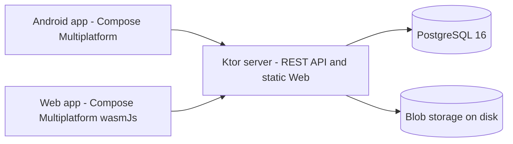

# BareZen-Drive

[English](README.md) | [简体中文](README.zh-CN.md)

BareZen-Drive is a self-hosted personal cloud drive (netdisk) that runs on your
own server. It gives you a private place to store, organize, download and share
files from an Android app, a desktop app or a browser. The whole stack is
Kotlin: Kotlin Multiplatform with Compose Multiplatform for the clients, a Ktor
server, PostgreSQL for metadata, and Docker Compose for deployment. It is tuned
to run comfortably on a small 1 vCPU / 1 GB RAM server.

Status: v0.0.2 | License: MIT | Platforms: Android, Web, Server

## Download

Packages are attached to the GitHub Releases (names carry the version):

| Package | File | For |
|---|---|---|
| Server distribution (with the Web client embedded) | `BareZen-Drive-<version>-server.tar.gz` | Deploy on your own machine with JDK 21 |
| Web client bundle | `BareZen-Drive-<version>-web.zip` | Static hosting, or copy into the server |
| Android | `BareZen-Drive-<version>-android.apk` | Install directly on a phone |
| Update manifest | `update.json` + `checksums.txt` | Read by the server for the in-app update check |
| Container image | `ghcr.io/linanwanttodo/barezen-drive:latest` | Docker / Docker Compose, linux/amd64 + linux/arm64 |

**Deploy the server with one command:**

```bash
curl -fsSL https://raw.githubusercontent.com/linanwanttodo/BareZen-Drive/master/install.sh | bash
```

The installer generates `.env` (auto-generating the JWT secret and database
password when left blank), pulls the image and starts PostgreSQL plus the
server. The full walkthrough - including closing open registration after your
first account - is in [docs/usage.md](docs/usage.md) (Chinese) and
[docs/usage.en.md](docs/usage.en.md) (English). Desktop and iOS packages are not
produced yet; see the end of that guide for why.

## Highlights

Shipped in v0.0.1 (see [docs/roadmap.md](docs/roadmap.md)):

- Authentication: registration, login and refresh-token rotation (15-minute JWT
  access token, 30-day opaque refresh token), with BCrypt password hashing.
- Virtual file system: folder create/rename/recursive delete, file
  rename/move/delete, and content-addressed blob storage with reference counting.
- Chunked uploads: resumable sessions, instant upload when a blob already
  exists, abort, and a cleanup job for expired sessions.
- Downloads: HTTP Range support (206 partial content, 416 when unsatisfiable).
- Clients: one Compose Multiplatform UI for Android and Web, with streaming
  whole-file SHA-256, per-chunk retries and upload progress.
- Web client hosting: the server serves the compiled Web app and falls back to
  the SPA entry point.
- Deployment: a three-stage Dockerfile and a Docker Compose file tuned for
  1 vCPU / 1 GB RAM.

Added after v0.0.1 on `master` (v0.2 development, see [docs/roadmap.md](docs/roadmap.md)):

- Client-side thumbnails and a photo album timeline, with a dedicated album root
  split into per-device folders.
- In-app preview for images, video, audio, text and PDF.
- Signed download URLs.
- Read-only share links with expiry and revocation, share counters and a share
  manager.
- Streaming chunk uploads on the server.
- Bilingual interface: English and Simplified Chinese, with a follow-the-system
  default selectable in Settings.
- Server-side update check: `GET /api/version` reports the server build and the
  newest upstream release, and Settings has a "Check for updates" entry on every
  client. The server is the single update authority, so clients behind a
  restricted network still get an answer; browser clients that outlived a server
  upgrade are offered a reload.
- Continuous integration builds the server, core and shared tests, the Android
  APKs, the Web wasm distribution and the container image. A macOS runner job is
  reserved for the iOS framework, and a Desktop job for the JVM distribution.

Planned for v0.3 and later:

- iOS and Desktop clients. Both targets are reserved: their platform
  interfaces and CI jobs are in place, and their `actual` implementations are
  the remaining work. The Desktop module is currently disabled in
  `settings.gradle.kts`.
- Multi-device sync and conflict resolution, end-to-end encryption, multi-node
  deployment, WebDAV and team spaces.

## Architecture

BareZen-Drive is split into a shared Kotlin core, a Ktor server and Compose
Multiplatform clients. The clients talk to the server over a JSON REST API. The
server keeps metadata in PostgreSQL and file content in a content-addressed blob
directory on disk, so the same bytes are stored only once and physical deletion
happens only when the last reference disappears.

Modules declared in `settings.gradle.kts`:

| Module | Path | Responsibility | Targets |
|---|---|---|---|
| `:core` | `core/` | Shared DTOs, error codes and build info | android, jvm, wasmJs |
| `:server` | `server/` | Ktor REST API, auth, storage, cleanup jobs, static Web hosting | jvm |
| `:app:shared` | `app/shared/` | Compose Multiplatform UI and data layer | android, wasmJs |
| `:app:androidApp` | `app/androidApp/` | Android entry point (MainActivity) | android |
| `:app:webApp` | `app/webApp/` | Web entry point | wasmJs |
| `:app:desktopApp` | `app/desktopApp/` | Desktop entry point (reserved, not enabled) | jvm |

The Desktop target is not included: the `include(":app:desktopApp")` line is
commented out in `settings.gradle.kts`.



## Tech stack

Versions are taken from `gradle/libs.versions.toml` and the Gradle wrapper.

| Area | Technology | Version |
|---|---|---|
| Language | Kotlin (Kotlin Multiplatform) | 2.4.10 |
| UI | Compose Multiplatform | 1.11.1 |
| UI | Compose Material 3 | 1.11.0-alpha07 |
| Server | Ktor | 3.5.2 |
| Server | Logback | 1.6.3 |
| Database | Exposed ORM | 0.61.0 |
| Database | HikariCP | 6.2.1 |
| Database | PostgreSQL JDBC driver | 42.7.12 |
| Database | PostgreSQL (Docker image) | 16 (postgres:16-alpine) |
| Database | H2 (tests) | 2.3.232 |
| Serialization | kotlinx.serialization | 1.9.0 |
| Async | kotlinx.coroutines | 1.11.0 |
| Time | kotlinx-datetime | 0.7.1 |
| Auth | BCrypt (at.favre) | 0.10.2 |
| Android | AndroidX Activity | 1.13.0 |
| Android | AndroidX Lifecycle | 2.11.0-beta01 |
| Android | AndroidX Security Crypto | 1.1.0-alpha06 |
| Android | AndroidX ExifInterface | 1.3.7 |
| Android | Media3 | 1.8.0 |
| Android | compileSdk / targetSdk | 36 |
| Android | minSdk | 24 |
| Build | Android Gradle Plugin | 9.0.1 |
| Build | Gradle (wrapper) | 9.7.1 |
| Build | JDK | 21 |

## Quick start

### Prerequisites

- JDK 21.
- Android SDK, for building or installing the Android app.
- Docker, optional. It is useful for a local PostgreSQL and for the deployment
  steps below.
- The Gradle wrapper downloads Gradle 9.7.1 on first use.

### Run the server

```bash
export SERVER_PORT=8080
export JDBC_URL="jdbc:postgresql://localhost:5432/barezen"
export DB_USER=barezen
export DB_PASSWORD=your-password
export JWT_SECRET="at-least-32-bytes-random-string"
export STORAGE_DIR=./data/storage
./gradlew :server:run
```

A local PostgreSQL is required for this path. To start one quickly:

```bash
docker run -d --name barezen-pg -p 5432:5432 \
  -e POSTGRES_DB=barezen -e POSTGRES_USER=barezen -e POSTGRES_PASSWORD=barezen \
  postgres:16-alpine
```

Once the server is up, `curl localhost:8080/health` returns `{"status":"ok"}`.

### Run the Android app

```bash
./gradlew :app:androidApp:assembleDebug   # APK only
./gradlew :app:androidApp:installDebug    # install to a connected device
```

The debug APK is written to
`app/androidApp/build/outputs/apk/debug/androidApp-debug.apk`. In the app, enter
the server address (for example `http://192.168.1.10:8080`) plus a username and
password on the login screen.

### Run the web app

```bash
./gradlew :app:webApp:wasmJsBrowserDevelopmentRun   # development run, opens a browser
./gradlew :app:webApp:wasmJsBrowserDistribution     # production output
```

The production output is written to
`app/webApp/build/dist/wasmJs/productionExecutable/`.

## Self-hosting with Docker Compose

```bash
cp .env.example .env
# edit .env and set JWT_SECRET and POSTGRES_PASSWORD
docker compose up -d --build
curl -s localhost:8080/health
```

The server listens on port 8080 inside the container. The `webApp` wasm build is
compiled in the first Dockerfile stage and served by the server, so opening the
mapped host port shows the Web client.

### Environment variables

Set these in `.env` (taken from `.env.example`):

| Variable | Meaning |
|---|---|
| `JWT_SECRET` | Secret used to sign JWTs. Must be at least 32 bytes. Generate one with `openssl rand -base64 48`. |
| `POSTGRES_DB` | PostgreSQL database name. Defaults to `barezen`. |
| `POSTGRES_USER` | PostgreSQL user. Defaults to `barezen`. |
| `POSTGRES_PASSWORD` | PostgreSQL password. Required, no default. |
| `SERVER_PORT` | Host port mapped to the container port 8080. Defaults to `8080`. |

`docker-compose.yml` injects these into the server container:

| Variable | Meaning |
|---|---|
| `JDBC_URL` | JDBC connection string, built as `jdbc:postgresql://db:5432/<POSTGRES_DB>`. |
| `DB_USER` | Database user, taken from `POSTGRES_USER`. |
| `DB_PASSWORD` | Database password, taken from `POSTGRES_PASSWORD`. |
| `STORAGE_DIR` | Directory for blobs and temporary upload files inside the container, `/data/storage`, bind-mounted to `./data/storage` on the host. |
| `SERVER_PORT` | Container listen port, fixed at `8080` in the compose file. |

The server also reads:

| Variable | Meaning |
|---|---|
| `MAX_FILE_SIZE` | Optional upper bound for a single file, default 10 GiB. |
| `UPDATE_REPO_URL` | Repository polled by `GET /api/version` for the newest release, default the upstream GitHub repository. |
| `GITHUB_TOKEN` | Optional token raising the GitHub release-check rate limit. |

## Update check

`GET /api/version` is public and returns the server build together with the
newest release the server could resolve:

```json
{"name":"BareZen-Drive","serverVersion":"0.0.1","apiVersion":1,
 "latestVersion":"0.0.1","releaseUrl":"https://github.com/.../releases/tag/v0.0.1",
 "updateAvailable":false}
```

Settings shows a "Check for updates" row on every client and calls this
endpoint. Calling the server instead of GitHub directly means clients behind a
restricted network still get an answer, and any failure degrades to "unknown"
rather than a false "update available". Browser clients also check once at
startup: if the server reports a newer version than the loaded bundle, they offer
a reload, which is how a server upgrade reaches already-open tabs.

## Continuous integration

`.github/workflows/ci.yml` runs on pushes and pull requests to `master`:

| Job | Runner | Output |
|---|---|---|
| `test` | ubuntu-latest | Server, core and shared tests, plus the wasm compile gate |
| `android` | ubuntu-latest | Debug and release APK artifacts |
| `web` | ubuntu-latest | Web wasm distribution artifact |
| `desktop` | ubuntu-latest | Desktop distribution when the target is enabled (reserved) |
| `ios` | macos-latest | Kotlin iOS framework and simulator app when Apple targets are enabled (reserved) |

`.github/workflows/docker-publish.yml` builds and publishes the server image to
GHCR on pushes to `master` and on `v*` tags.

`.github/workflows/release.yml` produces a GitHub Release with downloadable
packages. Pushing a `v*` tag creates the release automatically; `workflow_dispatch`
builds one from a branch. Attached files are the server distribution, the Web
bundle and the Android APKs, plus desktop and iOS packages once those targets are
enabled. Releases keep their files permanently and need no login to download,
unlike workflow artifacts.

GitHub can build iOS: its macOS runners ship the Xcode toolchain, and the `ios`
job is wired to build the Kotlin framework and the simulator app. The Apple
targets are not enabled in `app/shared/build.gradle.kts` yet, so the job detects
that and skips cleanly; enabling the targets turns the build on with no CI
changes. What remains for iOS is the iOS `actual` implementations (file picker,
cover generation, wallpaper, media/PDF preview, preferences and token storage)
plus the `iosArm64`/`iosSimulatorArm64` targets and a Darwin ktor engine. There
is no dependency blocker: the shared UI libraries (`backdrop`, `shapes`) do
publish iOS artifacts. Apple targets cannot be compiled on Linux, so this work
is verified on the macOS CI runner rather than locally.

## Testing

```bash
./gradlew :server:test --rerun-tasks --console=plain        # server tests
./gradlew :core:allTests --rerun-tasks --console=plain      # DTO and build-info tests
./gradlew :app:shared:testAndroidHostTest --console=plain   # shared module tests
./gradlew :app:shared:compileKotlinWasmJs --console=plain   # wasm compilation gate
```

Server tests use an H2 in-memory database in PostgreSQL compatibility mode, so
they do not need a local PostgreSQL.

## Documentation

- [docs/README.md](docs/README.md): index of the documentation set (Chinese).
- [docs/README.en.md](docs/README.en.md): index of the documentation set (English).
- [docs/architecture.md](docs/architecture.md): overall architecture, module
  layout, data model, upload protocol, client internationalization (i18n),
  update check and deployment.
- [docs/api.md](docs/api.md): REST API reference, including error codes.
- [docs/development.md](docs/development.md): local development, build and
  deployment guide.
- [docs/roadmap.md](docs/roadmap.md): completed scope and the roadmap.

## License

Released under the MIT License, copyright linanwanttodo.
