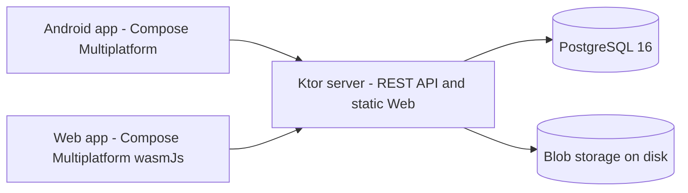
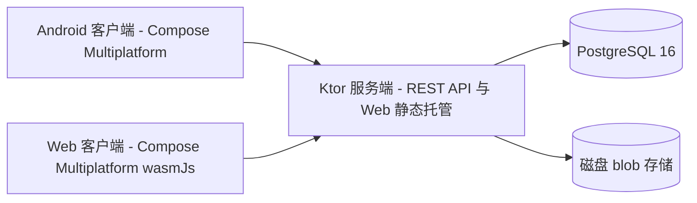

# BareZen-Drive

[English](#english) | [简体中文](#简体中文)

## English

BareZen-Drive is a self-hosted personal cloud drive (netdisk). It runs on your own server and gives you a private place to store, organize, download and share files from an Android app or a browser. The whole stack is Kotlin: Kotlin Multiplatform with Compose Multiplatform for the Android and Web clients, a Ktor server, PostgreSQL for metadata, and Docker Compose for deployment. It is designed to run comfortably on a small 1 vCPU / 1 GB RAM server. Current version: v0.0.1.

Status: v0.0.1 | License: MIT | Platforms: Android, Web, Server

### Highlights

Shipped in v0.0.1 (see `docs/roadmap.md`):

- Authentication: registration, login and refresh-token rotation (15-minute JWT access token, 30-day opaque refresh token), with BCrypt password hashing.
- Virtual file system: folder create/rename/recursive delete, file rename/move/delete, and content-addressed blob storage with reference counting.
- Chunked uploads: resumable sessions, instant upload when a blob already exists, abort, and a cleanup job for expired sessions.
- Downloads: HTTP Range support (206 partial content, 416 when unsatisfiable).
- Clients: Android and Web share one Compose Multiplatform UI, with streaming whole-file SHA-256, per-chunk retries and upload progress.
- Web client hosting: the server serves the compiled Web app and falls back to the SPA entry point.
- Deployment: a three-stage Dockerfile and a Docker Compose file tuned for 1 vCPU / 1 GB RAM.

Shipped on master after v0.0.1 (v0.2 development, see `docs/roadmap.md`):

- Client-side thumbnails and a photo album timeline, with a dedicated album root split into per-device folders.
- In-app preview for images, video, audio, text and PDF.
- Signed download URLs.
- Read-only share links with expiry and revocation, share counters and a share manager.
- Streaming chunk uploads on the server.
- Bilingual interface: English and Simplified Chinese, with a follow-the-system default selectable in Settings.

Planned for v0.3 and later:

- Multi-device sync and conflict resolution, end-to-end encryption, multi-node deployment, WebDAV and team spaces.
- iOS and Desktop clients are also planned. The desktop target is currently disabled in `settings.gradle.kts`.

### Architecture

BareZen-Drive is split into a shared Kotlin core, a Ktor server and two Compose Multiplatform clients. The clients talk to the server over a JSON REST API. The server keeps metadata in PostgreSQL and file content in a content-addressed blob directory on disk, so the same bytes are stored only once and physical deletion happens only when the last reference disappears.

Modules declared in `settings.gradle.kts`:

| Module | Path | Responsibility | Targets |
|---|---|---|---|
| `:core` | `core/` | Shared DTOs and error codes | android, jvm, wasmJs |
| `:server` | `server/` | Ktor REST API, auth, storage, cleanup jobs, static Web hosting | jvm |
| `:app:shared` | `app/shared/` | Compose Multiplatform UI and data layer | android, wasmJs |
| `:app:androidApp` | `app/androidApp/` | Android entry point (MainActivity) | android |
| `:app:webApp` | `app/webApp/` | Web entry point | wasmJs |

The desktop target is not included: the `include(":app:desktopApp")` line is commented out in `settings.gradle.kts`.



### Tech stack

Versions are taken from `gradle/libs.versions.toml` and the Gradle wrapper.

| Area | Technology | Version |
|---|---|---|
| Language | Kotlin (Kotlin Multiplatform) | 2.4.10 |
| UI | Compose Multiplatform | 1.11.1 |
| UI | Compose Material 3 | 1.11.0-alpha07 |
| Server | Ktor | 3.5.2 |
| Server | Logback | 1.6.3 |
| Database | Exposed ORM | 0.61.0 |
| Database | HikariCP | 6.2.1 |
| Database | PostgreSQL JDBC driver | 42.7.12 |
| Database | PostgreSQL (Docker image) | 16 (postgres:16-alpine) |
| Database | H2 (tests) | 2.3.232 |
| Serialization | kotlinx.serialization | 1.9.0 |
| Async | kotlinx.coroutines | 1.11.0 |
| Time | kotlinx-datetime | 0.7.1 |
| Auth | BCrypt (at.favre) | 0.10.2 |
| Android | AndroidX Activity | 1.13.0 |
| Android | AndroidX Lifecycle | 2.11.0-beta01 |
| Android | AndroidX Security Crypto | 1.1.0-alpha06 |
| Android | AndroidX ExifInterface | 1.3.7 |
| Android | Media3 | 1.8.0 |
| Android | compileSdk / targetSdk | 36 |
| Android | minSdk | 24 |
| Build | Android Gradle Plugin | 9.0.1 |
| Build | Gradle (wrapper) | 9.7.1 |
| Build | JDK | 21 |

### Quick start

#### Prerequisites

- JDK 21.
- Android SDK, for building or installing the Android app.
- Docker, optional. It is useful for a local PostgreSQL and for the deployment steps below.
- The Gradle wrapper downloads Gradle 9.7.1 on first use.

#### Run the server

```bash
export SERVER_PORT=8080
export JDBC_URL="jdbc:postgresql://localhost:5432/barezen"
export DB_USER=barezen
export DB_PASSWORD=your-password
export JWT_SECRET="at-least-32-bytes-random-string"
export STORAGE_DIR=./data/storage
./gradlew :server:run
```

A local PostgreSQL is required for this path. To start one quickly:

```bash
docker run -d --name barezen-pg -p 5432:5432 \
  -e POSTGRES_DB=barezen -e POSTGRES_USER=barezen -e POSTGRES_PASSWORD=barezen \
  postgres:16-alpine
```

Once the server is up, `curl localhost:8080/health` returns `{"status":"ok"}`.

#### Run the Android app

```bash
./gradlew :app:androidApp:assembleDebug   # APK only
./gradlew :app:androidApp:installDebug    # install to a connected device
```

The debug APK is written to `app/androidApp/build/outputs/apk/debug/androidApp-debug.apk`. In the app, enter the server address (for example `http://192.168.1.10:8080`) plus a username and password on the login screen.

#### Run the web app

```bash
./gradlew :app:webApp:wasmJsBrowserDevelopmentRun   # development run, opens a browser
./gradlew :app:webApp:wasmJsBrowserDistribution     # production output
```

The production output is written to `app/webApp/build/dist/wasmJs/productionExecutable/`.

### Self-hosting with Docker Compose

#### Steps

```bash
cp .env.example .env
# edit .env and set JWT_SECRET and POSTGRES_PASSWORD
docker compose up -d --build
curl -s localhost:8080/health
```

The server listens on port 8080 inside the container. The `webApp` wasm build is compiled in the first Dockerfile stage and served by the server, so opening the mapped host port shows the Web client.

#### Environment variables

Set these in `.env` (taken from `.env.example`):

| Variable | Meaning |
|---|---|
| `JWT_SECRET` | Secret used to sign JWTs. Must be at least 32 bytes. Generate one with `openssl rand -base64 48`. |
| `POSTGRES_DB` | PostgreSQL database name. Defaults to `barezen`. |
| `POSTGRES_USER` | PostgreSQL user. Defaults to `barezen`. |
| `POSTGRES_PASSWORD` | PostgreSQL password. Required, no default. |
| `SERVER_PORT` | Host port mapped to the container port 8080. Defaults to `8080`. |

`docker-compose.yml` injects these into the server container:

| Variable | Meaning |
|---|---|
| `JDBC_URL` | JDBC connection string, built as `jdbc:postgresql://db:5432/<POSTGRES_DB>`. |
| `DB_USER` | Database user, taken from `POSTGRES_USER`. |
| `DB_PASSWORD` | Database password, taken from `POSTGRES_PASSWORD`. |
| `STORAGE_DIR` | Directory for blobs and temporary upload files inside the container, `/data/storage`, bind-mounted to `./data/storage` on the host. |
| `SERVER_PORT` | Container listen port, fixed at `8080` in the compose file. |

The server also reads an optional `MAX_FILE_SIZE` (default 10 GiB) if it is set.

The repository includes a GitHub Actions workflow (`.github/workflows/docker-publish.yml`) that builds and publishes the image to GHCR on pushes to `master` and on `v*` tags.

### Testing

```bash
./gradlew :server:test --rerun-tasks --console=plain        # server tests (67 cases)
./gradlew :core:allTests --rerun-tasks --console=plain      # DTO serialization tests (3 cases)
./gradlew :app:shared:testAndroidHostTest --console=plain   # shared module tests (29 cases)
./gradlew :app:shared:compileKotlinWasmJs --console=plain   # wasm compilation gate
```

Server tests use an H2 in-memory database in PostgreSQL compatibility mode, so they do not need a local PostgreSQL.

### Documentation

- [docs/README.md](docs/README.md): index of the documentation set.
- [docs/architecture.md](docs/architecture.md): overall architecture, module layout, data model, upload protocol, client internationalization (i18n) and deployment.
- [docs/api.md](docs/api.md): REST API reference for v0.0.1, including error codes.
- [docs/development.md](docs/development.md): local development, build and deployment guide.
- [docs/roadmap.md](docs/roadmap.md): completed v0.0.1 scope and the v0.2 and later roadmap.

### License

Released under the MIT License, copyright linanwanttodo.

## 简体中文

BareZen-Drive 是一个自托管的个人私有云盘。它运行在你自己的服务器上，为你在 Android 客户端和浏览器中提供私密的空间，用于存储、整理、下载和分享文件。整个技术栈使用 Kotlin：客户端为 Kotlin Multiplatform + Compose Multiplatform（Android 与 Web），服务端为 Ktor，元数据使用 PostgreSQL，部署使用 Docker Compose。设计目标是在 1 核 1 GB 内存的小型服务器上流畅运行。当前版本：v0.0.1。

状态：v0.0.1 | 许可证：MIT | 平台：Android、Web、服务端

### 功能特性

v0.0.1 已发布（见 `docs/roadmap.md`）：

- 认证：注册、登录、刷新令牌轮换（15 分钟 JWT 访问令牌、30 天不透明刷新令牌），密码使用 BCrypt 哈希。
- 虚拟文件系统：文件夹新建/重命名/递归删除，文件重命名/移动/删除，内容寻址的 blob 存储与引用计数。
- 分块上传：断点续传会话、blob 已存在时的秒传、abort，以及过期会话清理任务。
- 下载：支持 HTTP Range（206 部分内容，无法满足时返回 416）。
- 客户端：Android 与 Web 共用一套 Compose Multiplatform UI，支持整文件流式 SHA-256、单块重试与上传进度。
- Web 客户端托管：服务端直接托管编译后的 Web 应用，并回退到 SPA 入口。
- 部署：三段式 Dockerfile，以及针对 1 核 1 GB 内存调优的 Docker Compose 配置。

v0.0.1 之后已在 master 上实现（v0.2 开发中，见 `docs/roadmap.md`）：

- 客户端缩略图与相册时间轴，并带独立的相册根目录与按设备划分的子文件夹。
- 应用内预览：图片、视频、音频、文本与 PDF。
- 签名下载 URL。
- 只读分享链接，支持过期与撤销，以及分享计数和分享管理页。
- 服务端分块流式上传。
- 双语界面：英文与简体中文，设置中默认跟随系统。

v0.3 及以后规划：

- 多设备同步与冲突解决、端到端加密、多节点部署、WebDAV 与团队空间。
- 规划中的还有 iOS 与 Desktop 客户端。Desktop target 当前在 `settings.gradle.kts` 中处于禁用状态。

### 架构

BareZen-Drive 分为共享的 Kotlin core、Ktor 服务端与两个 Compose Multiplatform 客户端。客户端通过 JSON REST API 与服务端通信。服务端把元数据保存在 PostgreSQL，把文件内容保存在内容寻址的磁盘 blob 目录中，因此相同字节只存一份，只有在最后一个引用消失时才会物理删除。

`settings.gradle.kts` 中声明的模块：

| 模块 | 路径 | 职责 | 目标平台 |
|---|---|---|---|
| `:core` | `core/` | 共享 DTO 与错误码 | android、jvm、wasmJs |
| `:server` | `server/` | Ktor REST API、认证、存储、清理任务、Web 静态托管 | jvm |
| `:app:shared` | `app/shared/` | Compose Multiplatform UI 与数据层 | android、wasmJs |
| `:app:androidApp` | `app/androidApp/` | Android 入口（MainActivity） | android |
| `:app:webApp` | `app/webApp/` | Web 入口 | wasmJs |

Desktop target 未包含：`settings.gradle.kts` 中的 `include(":app:desktopApp")` 一行已被注释。



### 技术栈

版本取自 `gradle/libs.versions.toml` 与 Gradle wrapper。

| 领域 | 技术 | 版本 |
|---|---|---|
| 语言 | Kotlin（Kotlin Multiplatform） | 2.4.10 |
| UI | Compose Multiplatform | 1.11.1 |
| UI | Compose Material 3 | 1.11.0-alpha07 |
| 服务端 | Ktor | 3.5.2 |
| 服务端 | Logback | 1.6.3 |
| 数据库 | Exposed ORM | 0.61.0 |
| 数据库 | HikariCP | 6.2.1 |
| 数据库 | PostgreSQL JDBC 驱动 | 42.7.12 |
| 数据库 | PostgreSQL（Docker 镜像） | 16（postgres:16-alpine） |
| 数据库 | H2（测试） | 2.3.232 |
| 序列化 | kotlinx.serialization | 1.9.0 |
| 异步 | kotlinx.coroutines | 1.11.0 |
| 时间 | kotlinx-datetime | 0.7.1 |
| 认证 | BCrypt（at.favre） | 0.10.2 |
| Android | AndroidX Activity | 1.13.0 |
| Android | AndroidX Lifecycle | 2.11.0-beta01 |
| Android | AndroidX Security Crypto | 1.1.0-alpha06 |
| Android | AndroidX ExifInterface | 1.3.7 |
| Android | Media3 | 1.8.0 |
| Android | compileSdk / targetSdk | 36 |
| Android | minSdk | 24 |
| 构建 | Android Gradle Plugin | 9.0.1 |
| 构建 | Gradle（wrapper） | 9.7.1 |
| 构建 | JDK | 21 |

### 快速开始

#### 环境要求

- JDK 21。
- Android SDK，用于构建或安装 Android 应用。
- Docker，可选。用于本地 PostgreSQL 和下方部署步骤。
- Gradle wrapper 在首次使用时自动下载 Gradle 9.7.1。

#### 运行服务端

```bash
export SERVER_PORT=8080
export JDBC_URL="jdbc:postgresql://localhost:5432/barezen"
export DB_USER=barezen
export DB_PASSWORD=你的密码
export JWT_SECRET="至少32字节的随机串"
export STORAGE_DIR=./data/storage
./gradlew :server:run
```

此方式需要本地 PostgreSQL。可以这样快速启动一个：

```bash
docker run -d --name barezen-pg -p 5432:5432 \
  -e POSTGRES_DB=barezen -e POSTGRES_USER=barezen -e POSTGRES_PASSWORD=barezen \
  postgres:16-alpine
```

服务端启动后，`curl localhost:8080/health` 返回 `{"status":"ok"}`。

#### 运行 Android 应用

```bash
./gradlew :app:androidApp:assembleDebug   # 仅出包
./gradlew :app:androidApp:installDebug    # 安装到已连接的设备
```

debug APK 输出到 `app/androidApp/build/outputs/apk/debug/androidApp-debug.apk`。在应用的登录页填写服务器地址（例如 `http://192.168.1.10:8080`）以及用户名和密码。

#### 运行 Web 应用

```bash
./gradlew :app:webApp:wasmJsBrowserDevelopmentRun   # 开发运行，自动打开浏览器
./gradlew :app:webApp:wasmJsBrowserDistribution     # 生产产物
```

生产产物输出到 `app/webApp/build/dist/wasmJs/productionExecutable/`。

### 使用 Docker Compose 自托管

#### 步骤

```bash
cp .env.example .env
# 编辑 .env，设置 JWT_SECRET 与 POSTGRES_PASSWORD
docker compose up -d --build
curl -s localhost:8080/health
```

服务端在容器内监听 8080 端口。`webApp` 的 wasm 构建在 Dockerfile 第一阶段完成并由服务端托管，因此打开映射到主机的端口即可看到 Web 客户端。

#### 环境变量

在 `.env` 中设置以下变量（来自 `.env.example`）：

| 变量 | 含义 |
|---|---|
| `JWT_SECRET` | 用于签发 JWT 的密钥。至少 32 字节。可用 `openssl rand -base64 48` 生成。 |
| `POSTGRES_DB` | PostgreSQL 数据库名。默认 `barezen`。 |
| `POSTGRES_USER` | PostgreSQL 用户名。默认 `barezen`。 |
| `POSTGRES_PASSWORD` | PostgreSQL 密码。必填，无默认值。 |
| `SERVER_PORT` | 映射到容器 8080 端口的主机端口。默认 `8080`。 |

`docker-compose.yml` 会向服务端容器注入以下变量：

| 变量 | 含义 |
|---|---|
| `JDBC_URL` | JDBC 连接串，构造成 `jdbc:postgresql://db:5432/<POSTGRES_DB>`。 |
| `DB_USER` | 数据库用户名，取自 `POSTGRES_USER`。 |
| `DB_PASSWORD` | 数据库密码，取自 `POSTGRES_PASSWORD`。 |
| `STORAGE_DIR` | 容器内 blob 与临时上传文件目录，`/data/storage`，绑定挂载到宿主机的 `./data/storage`。 |
| `SERVER_PORT` | 容器监听端口，在 compose 文件中固定为 `8080`。 |

服务端还会读取可选的 `MAX_FILE_SIZE`（默认 10 GiB）。

仓库包含一个 GitHub Actions 工作流（`.github/workflows/docker-publish.yml`），在推送到 `master` 以及 `v*` 标签时构建并发布镜像到 GHCR。

### 测试

```bash
./gradlew :server:test --rerun-tasks --console=plain        # 服务端测试（67 用例）
./gradlew :core:allTests --rerun-tasks --console=plain      # DTO 序列化测试（3 用例）
./gradlew :app:shared:testAndroidHostTest --console=plain   # 共享模块测试（29 用例）
./gradlew :app:shared:compileKotlinWasmJs --console=plain   # wasm 编译门
```

服务端测试使用 H2 内存数据库的 PostgreSQL 兼容模式，无需本地 PostgreSQL。

### 文档

- [docs/README.md](docs/README.md)：文档索引。
- [docs/architecture.md](docs/architecture.md)：总体架构、模块布局、数据模型、上传协议与部署。
- [docs/api.md](docs/api.md)：v0.0.1 的 REST API 参考，含错误码。
- [docs/development.md](docs/development.md)：本地开发、构建与部署指南。
- [docs/roadmap.md](docs/roadmap.md)：v0.0.1 已完成范围与 v0.2 及以后的路线图。

### 许可证

以 MIT 许可证发布，版权归 linanwanttodo 所有。
