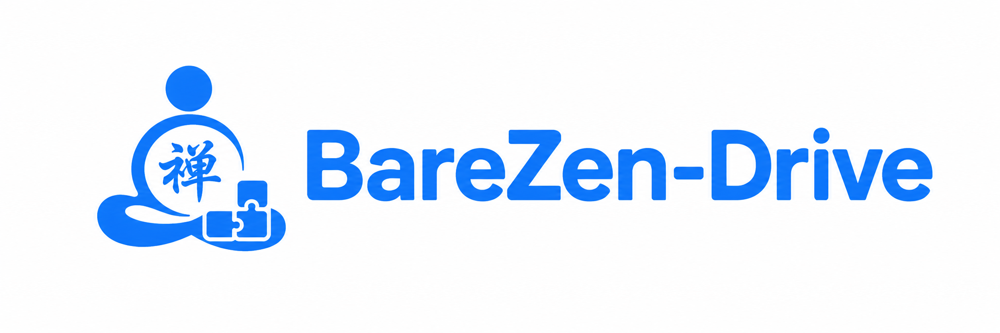
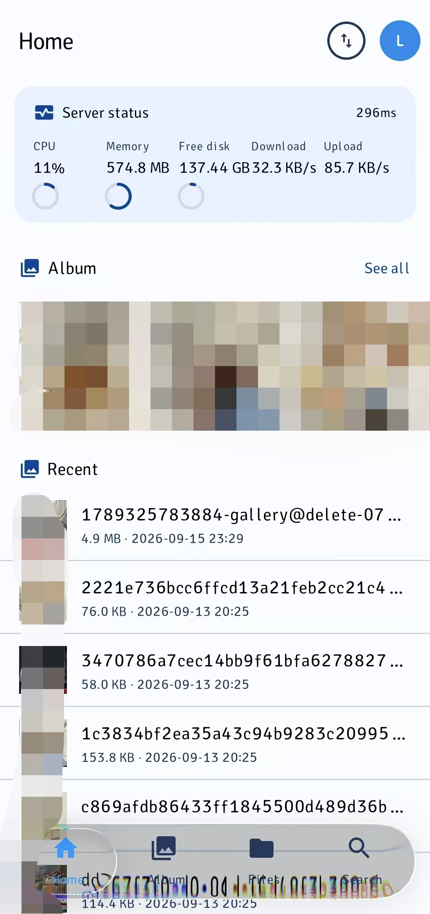
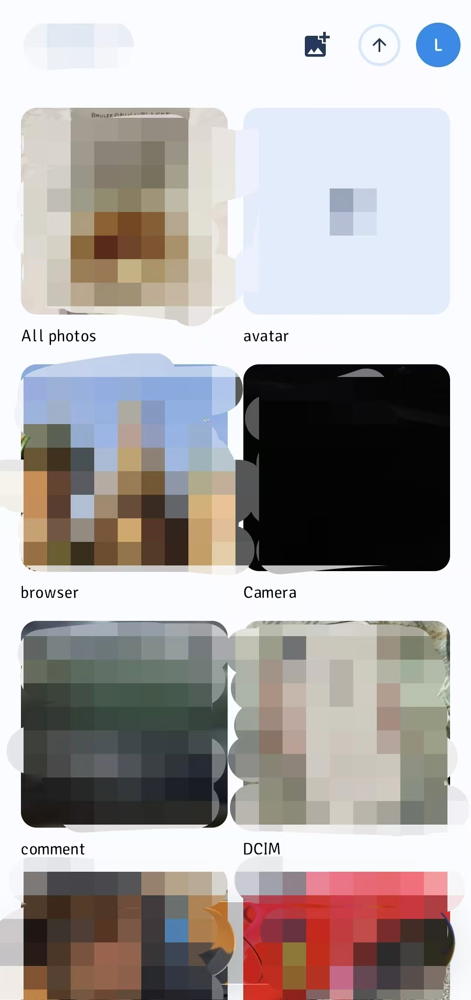
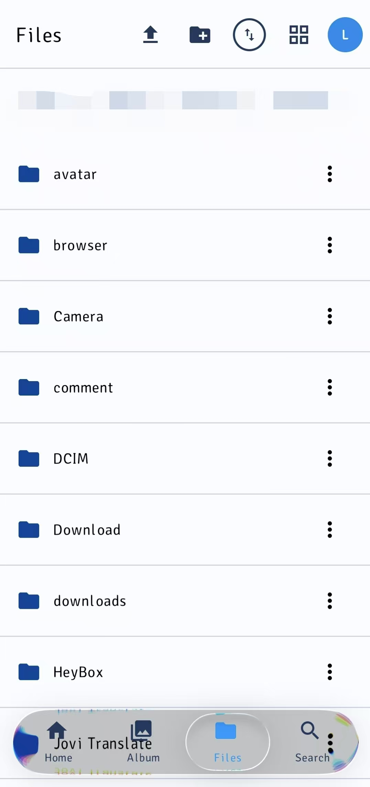
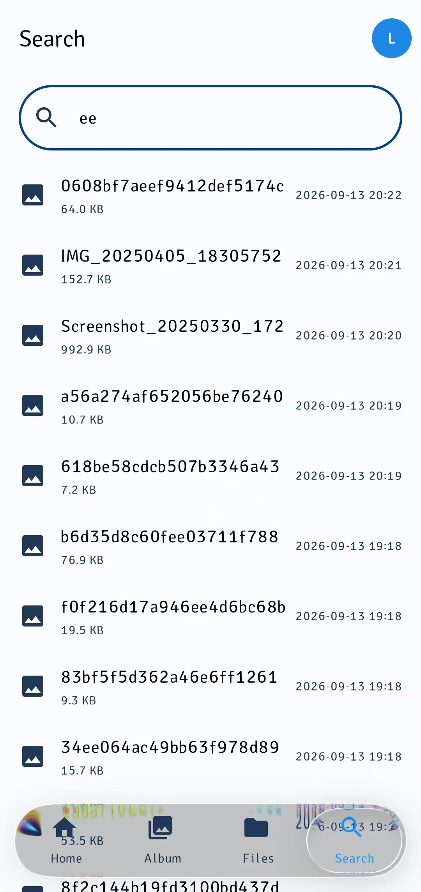
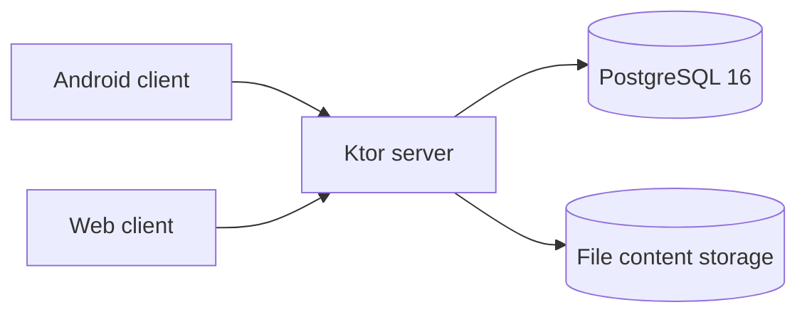

# BareZen-Drive

[](https://github.com/linanwanttodo/BareZen-Drive/releases)
[](https://github.com/linanwanttodo/BareZen-Drive/releases)
[](https://github.com/linanwanttodo/BareZen-Drive/blob/master/LICENSE)
[](https://github.com/linanwanttodo/BareZen-Drive)

<p align="center">
  
</p>

[English](README.md) | [简体中文](README.zh-CN.md)

A self-hosted personal cloud drive that runs on your own server. Store, organize,
download and share files from an Android app, a desktop app or a browser - with
your data fully under your control.

The whole stack is Kotlin: Compose Multiplatform for the clients, with a UI built
on Material 3 and Backdrop; a Ktor server; PostgreSQL for metadata; Docker Compose
for deployment. Tuned to run comfortably on a small 1 vCPU / 1 GB RAM server.

Version: 0.0.11 | License: MIT | Platforms: Android, Web, Server

## Quick start

Deploy the server with one command (requires Docker; the script generates the JWT
secret and database password for you):

```bash
curl -fsSL https://raw.githubusercontent.com/linanwanttodo/BareZen-Drive/master/install.sh | bash
```

Then open `http://<your-server>:8080` in a browser to see the Web client, and
register the first account to start using it.

Android packages are on the [Releases](https://github.com/linanwanttodo/BareZen-Drive/releases) page.

## Features

- File management: create, rename, move and delete folders and files;
  content-addressed storage keeps identical bytes only once.
- Transfer: chunked resumable uploads, instant upload, HTTP Range downloads and
  streaming whole-file SHA-256 verification.
- Albums: a photo timeline, a per-device album root, and per-album auto backup on
  Android.
- Preview and sharing: in-app preview for images, video, audio, text and PDF;
  read-only share links with expiry and revocation.
- Media library: favourites, archive, a 30-day trash and file version history (up
  to 20 revisions per file).
- Operations: a home status dashboard, a server-side update check and a bilingual
  interface (English / Simplified Chinese).
- Storage backend: local disk, or any S3-compatible object store (MinIO,
  Cloudflare R2, Tencent COS).

## Screenshots

| Home | Album | Files | Search |
|---|---|---|---|
|  |  |  |  |

## Architecture



Clients talk to the server over a JSON REST API. The server keeps metadata in
PostgreSQL and file content in content-addressed storage, so the same bytes are
stored only once and physical deletion happens only when the last reference
disappears.

## Tech stack

Versions are taken from `gradle/libs.versions.toml` and the Gradle wrapper.

| Area | Technology | Version |
|---|---|---|
| Language | Kotlin (Kotlin Multiplatform) | 2.4.20 |
| UI | Compose Multiplatform | 1.12.0 |
| UI | Compose Material 3 | 1.12.0-alpha03 |
| UI | Backdrop (io.github.kyant0) | 2.0.1 |
| Server | Ktor | 3.5.2 |
| Server | Logback | 1.6.3 |
| Database | Exposed ORM | 0.61.0 |
| Database | HikariCP | 7.1.0 |
| Database | PostgreSQL JDBC driver | 42.7.12 |
| Database | PostgreSQL (Docker image) | 16 (postgres:16-alpine) |
| Database | H2 (tests) | 2.5.250 |
| Serialization | kotlinx.serialization | 1.11.0 |
| Async | kotlinx.coroutines | 1.11.0 |
| Time | kotlinx-datetime | 0.8.0 |
| Auth | BCrypt (at.favre) | 0.10.2 |
| Android | AndroidX Activity | 1.13.0 |
| Android | AndroidX Lifecycle | 2.11.0 |
| Android | AndroidX Security Crypto | 1.1.0-alpha06 |
| Android | AndroidX ExifInterface | 1.4.2 |
| Android | Media3 | 1.11.0 |
| Android | compileSdk / targetSdk | 37 |
| Android | minSdk | 24 |
| Build | Android Gradle Plugin | 9.1.0 |
| Build | Gradle (wrapper) | 9.7.1 |
| Build | JDK | 21 |

## Links

| Entry | URL |
|---|---|
| Repository | https://github.com/linanwanttodo/BareZen-Drive |
| Releases | https://github.com/linanwanttodo/BareZen-Drive/releases |
| Issues | https://github.com/linanwanttodo/BareZen-Drive/issues |
| Container image | https://github.com/linanwanttodo/BareZen-Drive/pkgs/container/barezen-drive |
| Author | https://github.com/linanwanttodo |

## License

Released under the [MIT License](https://github.com/linanwanttodo/BareZen-Drive/blob/master/LICENSE),
copyright [linanwanttodo](https://github.com/linanwanttodo).

You are free to use, modify and distribute this project, including for commercial
purposes, as long as the original copyright notice and license text are kept. The
project is provided "as is", without warranty of any kind. Feedback and
suggestions are welcome via
[Issues](https://github.com/linanwanttodo/BareZen-Drive/issues).
