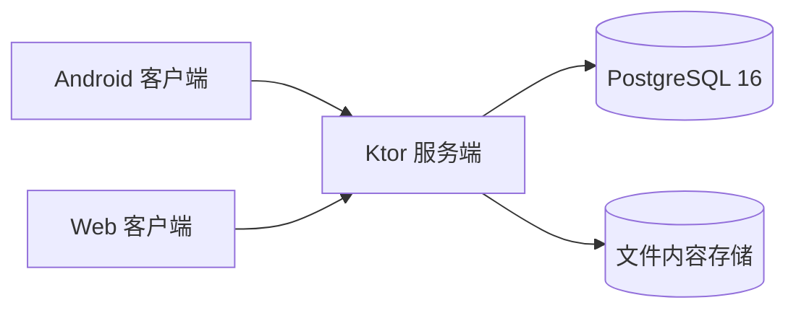

# BareZen-Drive

[](https://github.com/linanwanttodo/BareZen-Drive/releases)
[](https://github.com/linanwanttodo/BareZen-Drive/releases)
[](https://github.com/linanwanttodo/BareZen-Drive/blob/master/LICENSE)
[](https://github.com/linanwanttodo/BareZen-Drive)

<p align="center">
  
</p>

[English](README.md) | [简体中文](README.zh-CN.md)

自托管的个人私有云盘，运行在你自己的服务器上。在 Android 应用、桌面应用或浏览器中存储、整理、下载
与分享文件，数据完全由你掌控。

技术栈全用 Kotlin：客户端为 Compose Multiplatform，界面基于 Material 3 与 Backdrop；服务端为
Ktor；元数据存 PostgreSQL；部署走 Docker Compose。针对 1 核 1 GB 内存的小型服务器调优。

版本：0.0.10 | 许可证：MIT | 平台：Android、Web、服务端

## 快速开始

一条命令部署服务端（需要 Docker，脚本自动生成 JWT 密钥与数据库密码）：

```bash
curl -fsSL https://raw.githubusercontent.com/linanwanttodo/BareZen-Drive/master/install.sh | bash
```

完成后浏览器打开 `http://<服务器地址>:8080` 即可看到 Web 客户端，注册第一个账号即可使用。

Android 安装包见 [Releases](https://github.com/linanwanttodo/BareZen-Drive/releases)。

## 功能

- 文件管理：文件夹与文件的增删改移，内容寻址存储，相同内容只存一份。
- 上传下载：分块断点续传、秒传、HTTP Range 下载、整文件流式 SHA-256 校验。
- 相册：时间轴浏览、按设备分组的相册根目录、Android 端按相册自动备份。
- 预览与分享：图片、视频、音频、文本、PDF 应用内预览；只读分享链接，支持过期与撤销。
- 媒体库：收藏、归档、30 天回收站、文件版本历史（每个文件最多 20 版）。
- 运维：首页状态仪表盘、服务端统一检查更新、双语界面（简体中文 / English）。
- 存储后端：本地磁盘，或任意 S3 兼容对象存储（MinIO、Cloudflare R2、腾讯云 COS）。

## 界面

| 首页 | 相册 | 文件 | 搜索 |
|---|---|---|---|
|  |  |  |  |

## 架构



客户端与服务端通过 JSON REST API 通信。服务端把元数据存在 PostgreSQL，把文件内容存在内容寻址的
存储中，只有最后一个引用消失时才物理删除。

## 技术栈

版本取自 `gradle/libs.versions.toml` 与 Gradle wrapper。

| 领域 | 技术 | 版本 |
|---|---|---|
| 语言 | Kotlin（Kotlin Multiplatform） | 2.4.20 |
| UI | Compose Multiplatform | 1.12.0 |
| UI | Compose Material 3 | 1.12.0-alpha03 |
| UI | Backdrop（io.github.kyant0） | 2.0.1 |
| 服务端 | Ktor | 3.5.2 |
| 服务端 | Logback | 1.6.3 |
| 数据库 | Exposed ORM | 0.61.0 |
| 数据库 | HikariCP | 7.1.0 |
| 数据库 | PostgreSQL JDBC 驱动 | 42.7.12 |
| 数据库 | PostgreSQL（Docker 镜像） | 16（postgres:16-alpine） |
| 数据库 | H2（测试） | 2.5.250 |
| 序列化 | kotlinx.serialization | 1.11.0 |
| 异步 | kotlinx.coroutines | 1.11.0 |
| 时间 | kotlinx-datetime | 0.8.0 |
| 认证 | BCrypt（at.favre） | 0.10.2 |
| Android | AndroidX Activity | 1.13.0 |
| Android | AndroidX Lifecycle | 2.11.0 |
| Android | AndroidX Security Crypto | 1.1.0-alpha06 |
| Android | AndroidX ExifInterface | 1.4.2 |
| Android | Media3 | 1.11.0 |
| Android | compileSdk / targetSdk | 37 |
| Android | minSdk | 24 |
| 构建 | Android Gradle Plugin | 9.1.0 |
| 构建 | Gradle（wrapper） | 9.7.1 |
| 构建 | JDK | 21 |

## 链接

| 入口 | 地址 |
|---|---|
| 仓库主页 | https://github.com/linanwanttodo/BareZen-Drive |
| 下载发布版 | https://github.com/linanwanttodo/BareZen-Drive/releases |
| 问题反馈 | https://github.com/linanwanttodo/BareZen-Drive/issues |
| 容器镜像 | https://github.com/linanwanttodo/BareZen-Drive/pkgs/container/barezen-drive |
| 作者主页 | https://github.com/linanwanttodo |

## 开源说明

本项目以 [MIT 许可证](https://github.com/linanwanttodo/BareZen-Drive/blob/master/LICENSE) 发布，
版权归 [linanwanttodo](https://github.com/linanwanttodo) 所有。

你可以自由地使用、修改、分发本项目，包括用于商业用途，但需保留原始的版权声明与许可证文本。
项目按「现状」提供，不附带任何形式的担保。欢迎通过
[Issues](https://github.com/linanwanttodo/BareZen-Drive/issues) 反馈问题或提出建议。
