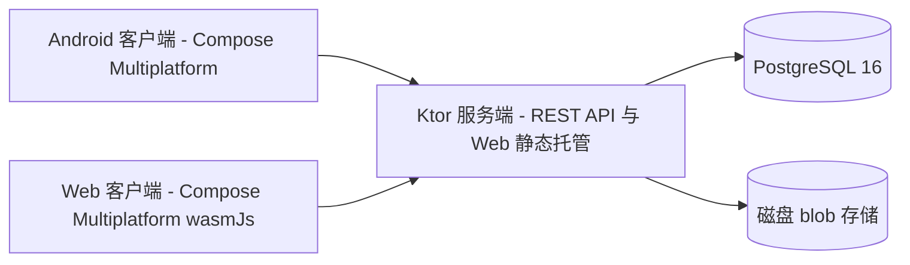

# BareZen-Drive

[English](README.md) | [简体中文](README.zh-CN.md)

BareZen-Drive 是一个自托管的个人私有云盘，运行在你自己的服务器上。它为你提供私密的空间，可以
在 Android 应用、桌面应用或浏览器中存储、整理、下载和分享文件。整个技术栈使用 Kotlin：客户端为
Kotlin Multiplatform + Compose Multiplatform，服务端为 Ktor，元数据使用 PostgreSQL，部署使用
Docker Compose。设计目标是在 1 核 1 GB 内存的小型服务器上流畅运行。

状态：v0.0.2 | 许可证：MIT | 平台：Android、Web、服务端

## 下载

安装包挂在 GitHub Releases 页（文件名带版本号）：

| 安装包 | 文件 | 用途 |
|---|---|---|
| 服务端发行包（内嵌 Web 客户端） | `BareZen-Drive-<版本>-server.tar.gz` | 在有 JDK 21 的机器上直接部署 |
| Web 客户端产物 | `BareZen-Drive-<版本>-web.zip` | 静态托管，或拷入服务端 |
| Android arm64-v8a | `BareZen-Drive-<版本>-android-arm64-v8a.apk` | 主流手机 |
| 更新清单 | `update.json` + `checksums.txt` | 供服务端读取，驱动应用内检查更新 |
| 容器镜像 | `ghcr.io/linanwanttodo/barezen-drive:latest` | Docker / Docker Compose，linux/amd64 与 linux/arm64 |

**一条命令部署服务器：**

```bash
curl -fsSL https://raw.githubusercontent.com/linanwanttodo/BareZen-Drive/master/install.sh | bash
```

安装脚本生成 `.env`（JWT 密钥与数据库密码留空自动生成）、拉取镜像并启动 PostgreSQL 与服务端。
完整步骤——包括注册第一个账号后如何关闭开放注册——见 [docs/usage.md](docs/usage.md)（中文）与
[docs/usage.en.md](docs/usage.en.md)（英文）。桌面端与 iOS 暂不产出安装包，原因见该文末说明。

## 功能特性

v0.0.1 已发布（见 [docs/roadmap.md](docs/roadmap.md)）：

- 认证：注册、登录、刷新令牌轮换（15 分钟 JWT 访问令牌、30 天不透明刷新令牌），密码使用 BCrypt
  哈希。
- 虚拟文件系统：文件夹新建/重命名/递归删除，文件重命名/移动/删除，内容寻址的 blob 存储与引用
  计数。
- 分块上传：断点续传会话、blob 已存在时的秒传、abort，以及过期会话清理任务。
- 下载：支持 HTTP Range（206 部分内容，无法满足时返回 416）。
- 客户端：Android 与 Web 共用一套 Compose Multiplatform UI，支持整文件流式 SHA-256、单块重试
  与上传进度。
- Web 客户端托管：服务端直接托管编译后的 Web 应用，并回退到 SPA 入口。
- 部署：三段式 Dockerfile，以及针对 1 核 1 GB 内存调优的 Docker Compose 配置。

v0.0.1 之后已在 master 上实现（v0.2 开发中，见 [docs/roadmap.md](docs/roadmap.md)）：

- 客户端缩略图与相册时间轴，并带独立的相册根目录与按设备划分的子文件夹。
- 应用内预览：图片、视频、音频、文本与 PDF。
- 签名下载 URL。
- 只读分享链接，支持过期与撤销，以及分享计数和分享管理页。
- 服务端分块流式上传。
- 双语界面：英文与简体中文，设置中默认跟随系统。
- 服务端检查更新：`GET /api/version` 返回服务端版本与可解析到的最新发布版本，设置页在每个客户端
  都提供「检查更新」入口。服务端是唯一的更新判定方，因此处于受限网络的客户端也能得到结果；浏览器
  客户端若在服务端升级后仍停留在旧页面，会被提示重新加载。
- 持续集成：构建服务端、core 与共享模块测试，Android APK、Web wasm 产物与容器镜像。macOS
  runner 已为 iOS framework 预留任务，Desktop 任务为 JVM 发行版预留。

v0.3 及以后规划：

- iOS 与 Desktop 客户端。两端均已预留：平台接口与 CI 任务就位，剩余工作是对应的 `actual` 实现。
  Desktop 模块当前在 `settings.gradle.kts` 中处于禁用状态。
- 多设备同步与冲突解决、端到端加密、多节点部署、WebDAV 与团队空间。

## 架构

BareZen-Drive 分为共享的 Kotlin core、Ktor 服务端与 Compose Multiplatform 客户端。客户端通过
JSON REST API 与服务端通信。服务端把元数据保存在 PostgreSQL，把文件内容保存在内容寻址的磁盘 blob
目录中，因此相同字节只存一份，只有在最后一个引用消失时才会物理删除。

`settings.gradle.kts` 中声明的模块：

| 模块 | 路径 | 职责 | 目标平台 |
|---|---|---|---|
| `:core` | `core/` | 共享 DTO、错误码与构建信息 | android、jvm、wasmJs |
| `:server` | `server/` | Ktor REST API、认证、存储、清理任务、Web 静态托管 | jvm |
| `:app:shared` | `app/shared/` | Compose Multiplatform UI 与数据层 | android、wasmJs |
| `:app:androidApp` | `app/androidApp/` | Android 入口（MainActivity） | android |
| `:app:webApp` | `app/webApp/` | Web 入口 | wasmJs |
| `:app:desktopApp` | `app/desktopApp/` | Desktop 入口（预留，未启用） | jvm |

Desktop target 未包含：`settings.gradle.kts` 中的 `include(":app:desktopApp")` 一行已被注释。



## 技术栈

版本取自 `gradle/libs.versions.toml` 与 Gradle wrapper。

| 领域 | 技术 | 版本 |
|---|---|---|
| 语言 | Kotlin（Kotlin Multiplatform） | 2.4.10 |
| UI | Compose Multiplatform | 1.11.1 |
| UI | Compose Material 3 | 1.11.0-alpha07 |
| 服务端 | Ktor | 3.5.2 |
| 服务端 | Logback | 1.6.3 |
| 数据库 | Exposed ORM | 0.61.0 |
| 数据库 | HikariCP | 6.2.1 |
| 数据库 | PostgreSQL JDBC 驱动 | 42.7.12 |
| 数据库 | PostgreSQL（Docker 镜像） | 16（postgres:16-alpine） |
| 数据库 | H2（测试） | 2.3.232 |
| 序列化 | kotlinx.serialization | 1.9.0 |
| 异步 | kotlinx.coroutines | 1.11.0 |
| 时间 | kotlinx-datetime | 0.7.1 |
| 认证 | BCrypt（at.favre） | 0.10.2 |
| Android | AndroidX Activity | 1.13.0 |
| Android | AndroidX Lifecycle | 2.11.0-beta01 |
| Android | AndroidX Security Crypto | 1.1.0-alpha06 |
| Android | AndroidX ExifInterface | 1.3.7 |
| Android | Media3 | 1.8.0 |
| Android | compileSdk / targetSdk | 36 |
| Android | minSdk | 24 |
| 构建 | Android Gradle Plugin | 9.0.1 |
| 构建 | Gradle（wrapper） | 9.7.1 |
| 构建 | JDK | 21 |

## 快速开始

### 环境要求

- JDK 21。
- Android SDK，用于构建或安装 Android 应用。
- Docker，可选。用于本地 PostgreSQL 和下方部署步骤。
- Gradle wrapper 在首次使用时自动下载 Gradle 9.7.1。

### 运行服务端

```bash
export SERVER_PORT=8080
export JDBC_URL="jdbc:postgresql://localhost:5432/barezen"
export DB_USER=barezen
export DB_PASSWORD=你的密码
export JWT_SECRET="至少32字节的随机串"
export STORAGE_DIR=./data/storage
./gradlew :server:run
```

此方式需要本地 PostgreSQL。可以这样快速启动一个：

```bash
docker run -d --name barezen-pg -p 5432:5432 \
  -e POSTGRES_DB=barezen -e POSTGRES_USER=barezen -e POSTGRES_PASSWORD=barezen \
  postgres:16-alpine
```

服务端启动后，`curl localhost:8080/health` 返回 `{"status":"ok"}`。

### 运行 Android 应用

```bash
./gradlew :app:androidApp:assembleDebug   # 仅出包
./gradlew :app:androidApp:installDebug    # 安装到已连接的设备
```

debug APK 输出到 `app/androidApp/build/outputs/apk/debug/androidApp-debug.apk`。在应用的登录页
填写服务器地址（例如 `http://192.168.1.10:8080`）以及用户名和密码。

### 运行 Web 应用

```bash
./gradlew :app:webApp:wasmJsBrowserDevelopmentRun   # 开发运行，自动打开浏览器
./gradlew :app:webApp:wasmJsBrowserDistribution     # 生产产物
```

生产产物输出到 `app/webApp/build/dist/wasmJs/productionExecutable/`。

## 使用 Docker Compose 自托管

```bash
cp .env.example .env
# 编辑 .env，设置 JWT_SECRET 与 POSTGRES_PASSWORD
docker compose up -d --build
curl -s localhost:8080/health
```

服务端在容器内监听 8080 端口。`webApp` 的 wasm 构建在 Dockerfile 第一阶段完成并由服务端托管，
因此打开映射到主机的端口即可看到 Web 客户端。

### 环境变量

在 `.env` 中设置以下变量（来自 `.env.example`）：

| 变量 | 含义 |
|---|---|
| `JWT_SECRET` | 用于签发 JWT 的密钥。至少 32 字节。可用 `openssl rand -base64 48` 生成。 |
| `POSTGRES_DB` | PostgreSQL 数据库名。默认 `barezen`。 |
| `POSTGRES_USER` | PostgreSQL 用户名。默认 `barezen`。 |
| `POSTGRES_PASSWORD` | PostgreSQL 密码。必填，无默认值。 |
| `SERVER_PORT` | 映射到容器 8080 端口的主机端口。默认 `8080`。 |

`docker-compose.yml` 会向服务端容器注入以下变量：

| 变量 | 含义 |
|---|---|
| `JDBC_URL` | JDBC 连接串，构造成 `jdbc:postgresql://db:5432/<POSTGRES_DB>`。 |
| `DB_USER` | 数据库用户名，取自 `POSTGRES_USER`。 |
| `DB_PASSWORD` | 数据库密码，取自 `POSTGRES_PASSWORD`。 |
| `STORAGE_DIR` | 容器内 blob 与临时上传文件目录，`/data/storage`，绑定挂载到宿主机的 `./data/storage`。 |
| `SERVER_PORT` | 容器监听端口，在 compose 文件中固定为 `8080`。 |

服务端还会读取：

| 变量 | 含义 |
|---|---|
| `MAX_FILE_SIZE` | 可选，单文件大小上限，默认 10 GiB。 |
| `UPDATE_REPO_URL` | `GET /api/version` 查询最新发布版本所用的仓库，默认上游 GitHub 仓库。 |
| `GITHUB_TOKEN` | 可选，用于提高 GitHub 发布查询的速率上限。 |

## 检查更新

`GET /api/version` 为公开接口，返回服务端版本以及服务端能解析到的最新发布版本：

```json
{"name":"BareZen-Drive","serverVersion":"0.0.1","apiVersion":1,
 "latestVersion":"0.0.1","releaseUrl":"https://github.com/.../releases/tag/v0.0.1",
 "updateAvailable":false}
```

设置页在每个客户端都提供「检查更新」入口并调用该接口。通过服务端而不是客户端直连 GitHub，使得处于
受限网络的客户端也能得到结果，且任何失败都退化为「未知」，不会误报「有新版本」。浏览器客户端还会在
启动时检查一次：若服务端版本高于当前加载的产物，则提示重新加载，这就是服务端升级触达已打开页面的
方式。

## 持续集成

`.github/workflows/ci.yml` 在推送到 `master` 以及向 `master` 发起 PR 时运行：

| 任务 | Runner | 产物 |
|---|---|---|
| `test` | ubuntu-latest | 服务端、core 与共享模块测试，以及 wasm 编译门 |
| `android` | ubuntu-latest | debug 与 release APK 产物 |
| `web` | ubuntu-latest | Web wasm 发行产物 |
| `desktop` | ubuntu-latest | Desktop 发行版（target 启用后生效，当前预留） |
| `ios` | macos-latest | Kotlin iOS framework 与模拟器应用（Apple target 启用后生效，当前预留） |

`.github/workflows/docker-publish.yml` 在推送到 `master` 以及 `v*` 标签时构建并发布服务端镜像到
GHCR。

`.github/workflows/release.yml` 产出带可下载安装包的 GitHub Release。推送 `v*` 标签会自动创建
release，也可用 `workflow_dispatch` 从分支构建。附件包含服务端发行包、Web 产物、Android APK，以及
桌面端与 iOS 目标启用后的对应安装包。Release 附件永久保留、下载无需登录，这与有会话时效的 Actions
artifacts 不同。

GitHub 可以构建 iOS：其 macOS runner 自带 Xcode 工具链，`ios` 任务已接好构建 Kotlin framework 与
模拟器应用的步骤。当前 `app/shared/build.gradle.kts` 尚未启用 Apple target，任务会检测到这一点并
干净跳过；启用 target 后无需改动 CI 即可开始构建。iOS 剩余的工作是补齐 iOS 的 `actual` 实现（文件
选择、封面生成、壁纸、媒体/PDF 预览、偏好与 token 存储），加上 `iosArm64`/`iosSimulatorArm64`
target 与 Darwin 版 ktor 引擎。依赖上没有阻碍：共享 UI 用到的 `backdrop`、`shapes` 都已发布 iOS
产物。Apple target 无法在 Linux 上编译，因此这部分需要靠 macOS CI runner 验证，而非本地。

## 测试

```bash
./gradlew :server:test --rerun-tasks --console=plain        # 服务端测试
./gradlew :core:allTests --rerun-tasks --console=plain      # DTO 与构建信息测试
./gradlew :app:shared:testAndroidHostTest --console=plain   # 共享模块测试
./gradlew :app:shared:compileKotlinWasmJs --console=plain   # wasm 编译门
```

服务端测试使用 H2 内存数据库的 PostgreSQL 兼容模式，无需本地 PostgreSQL。

## 文档

- [docs/README.md](docs/README.md)：文档索引（中文）。
- [docs/README.en.md](docs/README.en.md)：文档索引（英文）。
- [docs/architecture.md](docs/architecture.md)：总体架构、模块布局、数据模型、上传协议、客户端国际化
  （i18n）、检查更新与部署说明。
- [docs/api.md](docs/api.md)：REST API 参考，含错误码。
- [docs/development.md](docs/development.md)：本地开发、构建与部署指南。
- [docs/roadmap.md](docs/roadmap.md)：已完成范围与路线图。

## 许可证

以 MIT 许可证发布，版权归 linanwanttodo 所有。
