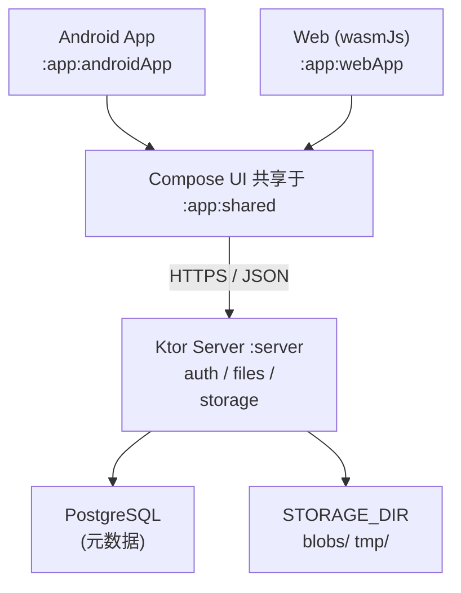

# BareZen-Drive v0.0.1 设计文档

- 日期：2026-09-02
- 状态：待审核（未提交 git）
- 范围版本：v0.0.1（Android 客户端 + Web 客户端 + 服务器端）

---

## 1. 背景与定位

BareZen-Drive 是一个**开源、自托管、跨平台的个人私有云盘**。用户在自己服务器上一键部署后，即可通过 Web 浏览器和 Android App 访问同一套文件系统：注册/登录、建文件夹、上传下载文件、重命名/删除、预览图片。

核心产品主张：**一次部署，所有设备互通**。数据完全归用户所有。

技术底座延续项目既定方向：全 Kotlin 技术栈 —— KMP + Compose Multiplatform 客户端、Ktor 服务器、PostgreSQL、Docker Compose 部署。

## 2. 已确认决策

| 决策点 | 结论 |
|---|---|
| v0.0.1 客户端平台 | Android + Web（Compose Web wasmJs），iOS/Desktop 后置 |
| 服务端语言 | Kotlin 全栈（JVM 平台；允许混用 Java——同一 JVM 内择优，如个别性能敏感点用 Java 实现；DTO 共享、依赖清单均按 Kotlin 生态走） |
| 数据库 | PostgreSQL 16（Exposed ORM，方言无关 schema） |
| 部署形态 | Docker Compose（server + postgres），Web 静态资源由 Ktor 托管 |
| 功能范围 | 网盘核心（见 3 节），分享链接/照片时间轴/回收站 -> v0.2 |
| 代码组织 | 精简分层：server 单模块按 feature 分包 + StorageProvider 小接口 + DTO 放 `:core` |
| 版本号 | 统一 0.0.1 |
| 文档 | 新建 `docs/` 目录存放所有文档 |
| 验证环境 | 用户自有服务器（1 核 1 GB 内存）可做全量验证 |
| 轻量化约束 | 依赖下载走国内镜像；KMP target 按 v0.0.1 范围裁剪；PG 低内存参数 + JVM 限堆 + swap；bcrypt cost 10（详见 5.1 节、10 节） |

## 3. 范围

### v0.0.1 包含

- 注册 / 登录 / 刷新 token / 退出登录（客户端清 token）
- 虚拟文件夹树：创建、重命名、移动、递归删除、面包屑导航
- 文件上传：分块上传协议（协议层完整支持断点续传），客户端 v0.0.1 顺序上传 + 单块重试
- 文件下载（支持 HTTP Range）
- 文件重命名、移动、删除
- 图片预览（客户端全量加载，Coil 3）
- Docker Compose 一键部署（server + postgres + web 静态托管）

### v0.0.1 不包含（进 roadmap，见 14 节）

分享链接、照片时间轴/EXIF/缩略图、回收站、文件版本、去重的用户可见功能（存储层已天然支持）、桌面客户端、iOS 客户端、服务端缩略图生成、后台上传（WorkManager）、端到端加密、同步。

## 4. 总体架构



关键原则（延续项目设计原则）：

- **File 与 Blob 分离**：`files` 表是用户可见的文件元数据；文件内容按 SHA-256 内容寻址存于存储层，多行可指向同一 blob。未来断点续传、秒传、去重、版本、多存储后端都建立在此之上。
- **虚拟文件系统**：API 只暴露 `folder`/`file` 记录与 UUID，绝不暴露真实磁盘路径。

## 5. 模块布局

保留现有 monorepo 模块，不新建、不删除：

| 模块 | v0.0.1 角色 |
|---|---|
| `:server` | Ktor 3.5.2 + Netty；Exposed + PostgreSQL 16；JWT 认证；托管 Web 静态资源 |
| `:core` | 共享 DTO（API 请求/响应模型）、错误码枚举、`ApiError` —— server 与两个客户端共用 |
| `:app:shared` | Compose UI（`ui/`）+ 客户端数据层（`data/`）+ expect/actual 平台层（`platform/`） |
| `:app:androidApp` | Android 入口（一等公民） |
| `:app:webApp` | Web 入口（一等公民，仅 wasmJs 目标，移除 js 目标） |
| `:app:desktopApp`、`:app:iosApp` | 不进 v0.0.1 构建：`:app:desktopApp` 从 settings.gradle 注释掉，iOS target 从构建脚本移除；源码/资源全部保留在磁盘，恢复只需几行配置 |

KMP target 裁剪（构建减重，理由见 5.1 节）：

- `:app:shared`：Android + wasmJs（移除 iOS×2、jvm、js）
- `:core`：Android + wasmJs + jvm（jvm 为 server 依赖 `:core` 所需）
- `:app:webApp`：仅 wasmJs

新增依赖（全部登记进 `gradle/libs.versions.toml`，取编写时最新稳定版）：

- 服务端：`ktor-server-auth`、`ktor-server-auth-jwt`、`ktor-server-content-negotiation`、`ktor-serialization-kotlinx-json`、`ktor-server-call-logging`、`ktor-server-partial-content`、`ktor-server-status-pages`、`exposed-core/jdbc`、`postgresql`、`hikariCP`、`bcrypt`（at.favre）、`h2`（仅测试）
- 客户端：ktor-client-core、ktor-client-okhttp（Android 引擎）、ktor-client-js（Web 引擎）、ktor-client-auth（Bearer 自动刷新）、ktor-client-content-negotiation、kotlinx-serialization-json、androidx-security-crypto（Android EncryptedSharedPreferences）。图片预览用 Compose 自带 `decodeToImageBitmap`，导航用轻量自实现回退栈 —— **不引入 Coil / navigation 等额外依赖**（减重）。

server 的 project version 改为 `0.0.1`。

### 5.1 构建减重（针对依赖下载慢与弱机）

- **仓库镜像**：`settings.gradle.kts` 的 `pluginManagement` 与 `dependencyResolutionManagement` 中，在 `google()`、`mavenCentral()` 前插入 Aliyun 镜像（`maven.aliyun.com/repository/google|public`）；`gradle-wrapper.properties` 的 `distributionUrl` 换为腾讯镜像（`mirrors.cloud.tencent.com/gradle/`）。目标：首次依赖下载从数十分钟量级降到分钟级。
- **target 裁剪**：见上节 —— IDE 同步与构建只拉取/编译 v0.0.1 实际使用的 target。
- v0.0.1 新增依赖总量 < 10MB（Exposed ~= 2MB、postgres 驱动 ~= 1MB、H2 仅测试 ~= 2.5MB、其余合计数 MB），首次下载耗时的大头是模板既有依赖与 Gradle 本体，由镜像解决。

## 6. 服务端设计

### 6.1 包结构

基础包沿用 `com.linan.barezen_drive`：

```text
server/src/main/kotlin/com/linan/barezen_drive/
  |-- Application.kt                // 装配：config -> db -> storage -> services -> routes -> plugins
  |-- config/AppConfig.kt           // 从环境变量读取（见 6.7 节）
  |-- db/DatabaseFactory.kt         // HikariCP + Exposed 连接；启动时 createMissingTablesAndColumns
  |-- db/Tables.kt                  // 全部 Exposed 表定义
  |-- auth/AuthRoutes.kt
  |-- auth/AuthService.kt           // 注册/登录/刷新/轮换
  |-- auth/JwtService.kt            // 签发/校验 access token
  |-- auth/PasswordHasher.kt        // BCrypt 封装
  |-- files/FolderRoutes.kt
  |-- files/FileRoutes.kt
  |-- files/UploadRoutes.kt
  |-- files/FileService.kt          // 列目录/建目录/重命名/移动/删除（含引用计数删 blob）
  |-- files/UploadService.kt        // init/chunk/complete/abort/断点续传匹配
  |-- storage/StorageProvider.kt    // put/get/delete/exists(key, ByteReadChannel)
  |-- storage/LocalStorageProvider.kt
  `-- plugins/                      // Serialization, StatusPages, Authentication(JWT), PartialContent, CallLogging
```

### 6.2 数据库 ER（6 张表）

```text
users            id UUID PK · username UNIQUE · password_hash · created_at
refresh_tokens   id UUID PK · user_id FK->users · token_hash · expires_at · revoked_at? · created_at
folders          id UUID PK · user_id FK->users · parent_id FK->folders 可空(NULL=根层) · name
                 · created_at · updated_at
                 UNIQUE(user_id, parent_id, name)
files            id UUID PK · user_id FK->users · folder_id FK->folders 可空 · name · size BIGINT
                 · mime_type · sha256 CHAR(64) · storage_key · created_at · updated_at
                 UNIQUE(user_id, folder_id, name)
upload_sessions  id UUID PK · user_id FK · folder_id FK · name · size BIGINT · mime_type
                 · chunk_size INT · client_sha256 可空 · status(open|completed|aborted)
                 · created_at · expires_at
upload_chunks    session_id FK->upload_sessions · chunk_index INT · size BIGINT
                 PK(session_id, chunk_index)
```

设计要点：

- **不建物理根目录行**：`parent_id IS NULL` 即根层；根层不可重命名/移动/删除。
- `storage_key` 显式存储（而非由 sha256 推导），为未来多存储后端保留解耦。
- v0.0.1 用 Exposed `SchemaUtils.createMissingTablesAndColumns` 做启动迁移；schema 稳定后（v0.2+）引入 Flyway。
- ID 统一用数据库原生 UUID 类型（H2 测试库启用 PostgreSQL 兼容模式），保证测试可用 H2 内存库。

### 6.3 存储层

```kotlin
interface StorageProvider {
    suspend fun put(key: String, channel: ByteReadChannel)
    suspend fun get(key: String): ByteReadChannel
    suspend fun delete(key: String)
    suspend fun exists(key: String): Boolean
}
```

- `LocalStorageProvider`：blob 布局 `STORAGE_DIR/blobs/<sha256 前 2 位>/<第 3-4 位>/<sha256>`；上传中分块暂存 `STORAGE_DIR/tmp/<uploadId>/<index>.part`。
- `put` 内容寻址：blob 已存在则跳过写入（天然去重 + 秒传的基础）。
- **删除引用计数**：删除 `files` 行时 `COUNT(*) FROM files WHERE sha256 = ?`，为 0 才物理删除 blob；递归删文件夹在同一事务内逐文件执行。
- v0.0.1 只实现 Local 一个 Provider；S3/MinIO 实现是 v0.2+，接口已就位。

### 6.4 认证

- 注册：用户名 3–32 位 `[a-zA-Z0-9_]`；密码 >= 8 位；BCrypt cost 10（1 核服务器上校验约 200–300ms，安全性与弱机性能的平衡）。
- 登录成功返回：`accessToken`（JWT HS256，`sub` = user id，15 分钟，密钥来自 env `JWT_SECRET`）+ `refreshToken`（32 字节随机 opaque，30 天有效；库中只存其 SHA-256）。
- 刷新：旧 refresh token 置 `revoked_at` 并签发新的（轮换）；过期/已吊销 -> 401。
- Ktor `Authentication(JWT)` 保护 `/api/**`（auth 三个端点除外）。
- 不做：邮箱验证、OAuth、2FA（roadmap）。

### 6.5 API 定义（v0.0.1 全量）

所有请求/响应体为 JSON；除 auth 外均需 `Authorization: Bearer <accessToken>`。错误统一为 `{"error":{"code":"...","message":"..."}}`（8 节）。

| 方法 | 路径 | 说明 |
|---|---|---|
| GET | `/health` | 健康检查（无认证） |
| POST | `/api/auth/register` | `{username, password}` -> `{user}` |
| POST | `/api/auth/login` | `{username, password}` -> `{accessToken, refreshToken, user}` |
| POST | `/api/auth/refresh` | `{refreshToken}` -> `{accessToken, refreshToken}` |
| GET | `/api/me` | 当前用户信息 |
| GET | `/api/folders/{id}/contents` | 列目录；`id="root"` 表示根层 -> `{folder, folders[], files[]}` |
| POST | `/api/folders` | `{parentId?, name}`（parentId 空 = 根层）-> `{folder}` |
| PATCH | `/api/folders/{id}` | `{name}` 重命名 -> `{folder}` |
| DELETE | `/api/folders/{id}` | 递归删除（含全部子孙文件，v0.0.1 真删）-> 204 |
| PATCH | `/api/files/{id}` | `{name?, folderId?}` 重命名/移动 -> `{file}` |
| DELETE | `/api/files/{id}` | 删除 -> 204 |
| POST | `/api/uploads/init` | `{folderId?, name, size, mimeType?, sha256?, chunkSize?}` -> `{uploadId, chunkSize, receivedChunks[], instantUpload?}` |
| PUT | `/api/uploads/{id}/chunks/{index}` | octet-stream 二进制体；可选 `X-Chunk-Sha256` 校验，不符 400 |
| POST | `/api/uploads/{id}/complete` | 校验分块齐全 -> 合并 -> `{file}` |
| DELETE | `/api/uploads/{id}` | 放弃上传（清 tmp、session 置 aborted）-> 204 |
| GET | `/api/files/{id}/content` | 下载文件内容；启用 Range（PartialContent） |

语义细则：

- **移动校验**：文件夹不可移动到自身或其子孙目录下（400）。
- **重名冲突**：同目录下 folder/file 同名 -> 409 `NAME_CONFLICT`。
- **秒传**：init 时 `sha256` 命中已有 blob 且同用户同目录同名不冲突 -> 直接创建 `files` 行并返回 `instantUpload=true`，无需上传分块。
- **断点续传**：客户端持 `uploadId` 重调 `init`（参数一致）-> 返回该 session 已收到的 `receivedChunks[]`，客户端跳过这些块续传；`uploadId` 丢失时，服务端用 `(userId, folderId, name, size, client_sha256)` 匹配 open session 兜底。
- **分块大小**：服务端定默认 5 MiB，init 的 `chunkSize` 被钳制到 1–20 MiB；响应中返回最终 `chunkSize`，客户端以其为准。

### 6.6 上传流程（服务端）

1. `init`：创建/复用 open session（expires_at = 24h）。
2. `PUT chunk`：写入 `tmp/<uploadId>/<index>.part`（幂等：重复 PUT 覆盖），登记 `upload_chunks`。
3. `complete`：校验 `ceil(size / chunkSize)` 块齐全且单块大小正确 -> 按序流式合并，边合并边算 SHA-256 -> `StorageProvider.put(blobs/…, 合并流)`（已存在则跳过）-> 事务内建 `files` 行、session 置 completed -> 清 tmp。
4. 清理：每日协程任务删除过期 open session 及其 tmp 目录。

### 6.7 配置（环境变量）

| 变量 | 默认 | 说明 |
|---|---|---|
| `SERVER_PORT` | `8080` | HTTP 端口 |
| `JDBC_URL` | — | 如 `jdbc:postgresql://db:5432/barezen` |
| `DB_USER` / `DB_PASSWORD` | — | 数据库凭据 |
| `JWT_SECRET` | — | >= 32 字节随机串，必填 |
| `STORAGE_DIR` | `./data/storage` | blob 与 tmp 根目录 |
| `MAX_FILE_SIZE` | `10 GiB` | 单文件上限 |
| `UPLOAD_CHUNK_MIN/MAX` | `1 MiB / 20 MiB` | 分块钳制范围 |

## 7. 客户端设计（Android + Web 共享 `:app:shared`）

### 7.1 包结构

```text
app/shared/src/commonMain/kotlin/com/linan/barezen_drive/
  |-- App.kt                        // 根 Composable + 导航
  |-- ui/theme/
  |-- ui/screens/login/  register/  files/  preview/
  |-- data/api/ApiClient.kt         // ktor-client；BaseUrl 管理；自动附 token；401 自动刷新重放
  |-- data/repo/AuthRepository.kt   // -> Result<T, ApiError>
  |-- data/repo/FilesRepository.kt
  |-- data/upload/UploadManager.kt  // 分块 + sha256 + 进度 StateFlow + 单块重试
  |-- data/local/TokenStorage.kt    // expect/actual
  |-- platform/FilePicker.kt        // expect/actual：选文件上传（Android SAF / Web File API）
  |-- platform/FileSaver.kt         // expect/actual：下载保存（Android SAF / Web Blob 下载）
  `-- platform/Sha256er.kt          // expect/actual
```

- `FilesRepository` / `AuthRepository` 统一返回 `Result<T, ApiError>`；`ApiError`（code + message）复用 `:core` 的错误码。
- `UploadManager`：5 MiB 分块（以服务端 init 返回的 chunkSize 为准）、上传前流式计算整文件 SHA-256（Android 走 MessageDigest 加速，Web 走纯 Kotlin 增量实现）用于 init 的秒传/续传匹配、逐块 SHA-256、顺序 PUT、单块失败指数退避重试 3 次、进度为按文件的 `StateFlow<Map<String, Progress>>`。v0.0.1 前台协程执行（页面退出即取消，明确告知用户；后台任务 v0.2）。
- 图片预览：经 ApiClient 拉取字节流，用 Compose `decodeToImageBitmap` 显示（不引入 Coil）；服务端缩略图 v0.2。
- 登录页含**服务器地址输入框**（存本地），这是自托管产品的核心体验。

### 7.2 expect/actual

| 能力 | Android actual | Web actual（wasmJs） |
|---|---|---|
| `TokenStorage` | EncryptedSharedPreferences | localStorage（v0.0.1 接受其 XSS 暴露面，见 15 节） |
| `FilePicker`（选文件上传） | SAF `ActivityResultContracts.OpenDocument`（多选） | 浏览器 `<input type=file>`（kotlin-wrappers browser） |
| `FileSaver`（下载保存） | SAF `CreateDocument` | 浏览器下载（Blob + a[download]） |
| `Sha256er` | `java.security.MessageDigest`（加速） | 纯 Kotlin 增量 SHA-256（commonMain 实现；WebCrypto 不支持流式） |
| ktor-client 引擎 | OkHttp | Js（浏览器 fetch） |

Web 上传用 `File.slice()` 分块，整文件不进内存。

### 7.3 UI 流

登录/注册 -> 文件浏览器（面包屑 + 文件夹/文件列表、mime 图标、新建文件夹、上传入口、长按/右键菜单：重命名/移动/删除/下载）-> 点图片进入预览。导航用轻量自实现回退栈（`List<Screen>` state + push/pop），不引入 navigation 依赖。

## 8. 错误处理约定

- HTTP 状态码 + 统一响应体 `{"error":{"code":"...","message":"人类可读信息"}}`。
- 错误码枚举定义在 `:core`，客户端按 code 决定行为（如 401 触发刷新）：
  `INVALID_CREDENTIALS`、`TOKEN_INVALID`、`TOKEN_EXPIRED`、`USERNAME_INVALID`、`USERNAME_TAKEN`、`PASSWORD_TOO_SHORT`、`VALIDATION_ERROR`、`NOT_FOUND`、`NAME_CONFLICT`、`FOLDER_INTO_DESCENDANT`、`SESSION_NOT_FOUND`、`SESSION_COMPLETED`、`SESSION_EXPIRED`、`CHUNK_INVALID`、`CHUNK_MISSING`、`FILE_TOO_LARGE`、`INTERNAL_ERROR`。
- StatusPages 兜底：未捕获异常 -> 500 `INTERNAL_ERROR`（日志记录堆栈，不外泄细节）。
- 参数校验失败 -> 400 `VALIDATION_ERROR`。

## 9. 测试策略

| 层 | 工具 | 覆盖 |
|---|---|---|
| `:server` | Ktor testHost + H2 内存库 | 注册/登录/刷新轮换；文件夹 CRUD + 重名 409 + 移入子孙 400；上传协议（乱序、断点续传、秒传、complete 缺块、chunk sha 不符）；下载 Range；删除后 blob 引用计数 |
| `:core` | kotlin-test | DTO 序列化 round-trip；错误码枚举 |
| `:app:shared` | commonTest | UploadManager 分块逻辑（内存 fake source + fake ApiClient）；API 模型解析 |
| 端到端 | 用户服务器 | 见 13 节清单 |

注：Exposed schema 保持方言无关（6.2 节），H2 测试与 PG 生产的风险通过发布前真实 PG 冒烟兜底。

## 10. 部署

- `Dockerfile`（server 模块）：multi-stage —— gradle 构建 fat jar -> temurin JRE 运行。
- `docker-compose.yml`（按 1 核 1 GB 服务器调优）：
  - `server`：构建自 Dockerfile，JVM 参数 `-Xms64m -Xmx256m`，挂载 `./data/storage`，env 接 `JWT_SECRET` 等；
  - `db`：`postgres:16-alpine`，启动参数限低内存（`shared_buffers=64MB`、`max_connections=20`、`work_mem=4MB`），卷 `pgdata`，healthcheck；
  - server 依赖 db 健康后启动。
- **1G1C 内存预算**：server 约 150–250MB + PG 约 80–150MB + OS/Docker 约 100–200MB ~= 350–600MB；部署文档指导用户另建 1GB swap 作保险。上传/下载全程流式（5MB 分块、边收边算哈希），堆内不会出现整文件缓冲。
- `.env.example` 列出全部必填变量。
- **Web 托管**：构建期把 `:app:webApp` 的 `wasmJsBrowserDistribution` 产物复制进 server 镜像的 `/app/web` 目录，由 Ktor `staticResources` 托管在 `/`（SPA fallback 到 index.html；`/api/*` 路由优先于静态资源）。部署完成后浏览器打开服务器地址即 Web 客户端。
- `install.sh` 一键脚本推迟到 v0.2。

## 11. 文档目录

```text
docs/
  |-- README.md            // 文档索引（本目录）
  |-- architecture.md      // 总体架构（由本 spec 提炼，实施阶段产出）
  |-- api.md               // API 参考 v0.0.1（实施阶段产出）
  |-- development.md       // 本地开发指南：compose up / gradle 命令（实施阶段产出）
  |-- roadmap.md           // v0.2+ 路线图（实施阶段产出）
  `-- superpowers/specs/2026-09-02-barezen-drive-v0.0.1-design.md   // 本设计文档
```

## 12. 版本号

- server project version -> `0.0.1`；Android `versionName = "0.0.1"`、`versionCode = 1`；README/docs 标注 v0.0.1 范围。

## 13. 验证清单（用户服务器全量跑）

1. `docker compose up -d` 一次成功，`/health` 200，浏览器打开根路径出现 Web 客户端。
2. Web：注册 -> 登录 -> 建文件夹（含嵌套）-> 上传小文件 -> 上传 > 20 MiB 文件（多分块）-> 上传中断网后续传 -> 秒传同文件 -> 下载并比对内容 -> 重命名/移动/删除 -> 图片预览。
3. Android App：连接用户服务器，重复上述核心链路；401 后自动刷新 token 不掉登录。
4. 并发/异常：两个设备同时改同名不崩溃；删除文件夹后存储 blob 引用计数正确（tmp 无残留）。

## 14. 非目标与路线图

- **v0.2**：分享链接、回收站、服务端缩略图 + EXIF/照片时间轴、文件版本、WorkManager 后台/自动上传、S3/MinIO StorageProvider、Flyway 迁移、`install.sh` 一键脚本、iOS 客户端、Desktop 客户端。
- **v0.3+**：同步与冲突解决、端到端加密、多节点、WebDAV、团队空间。

## 15. 风险与备注

- **Compose Web（wasmJs）较新**：首包较大、生态年轻；API 不变的前提下，未来如不达标可独立评估传统前端重写（本 spec 的 REST API 是稳定边界）。
- **localStorage 存 token（Web）**：存在 XSS 暴露面；v0.0.1 接受，v0.2 评估 HttpOnly cookie 方案。
- **H2 测试与 PG 生产方言差异**：schema 仅用通用类型 + 发布前真实 PG 冒烟兜底。
- **上传合并的磁盘峰值**：tmp 分块 + 合并副本瞬时占约 2× 文件大小；个人规模可接受，v0.2 评估边收边写。
